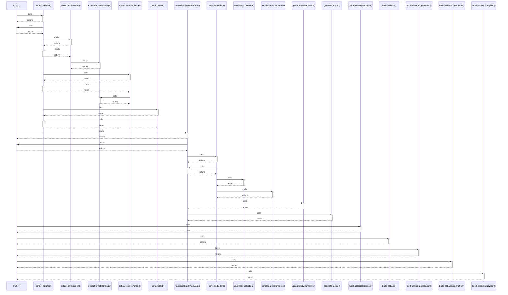

# POST()

> God node · 14 connections · [C:\Users\Asus\.gemini\antigravity\scratch\studysync-ai\src\app\api\study-materials\parse\route.ts](file:///C:/Users/Asus/.gemini/antigravity/scratch/studysync-ai/src/app/api/study-materials/parse/route.ts#L14)

## Call Trace Diagram

## Connections by Relation

### calls
- [[parseFileBuffer()]] `INFERRED`
- [[normalizeStudyPlanData()]] `INFERRED`
- [[buildFallbackResponse()]] `EXTRACTED`
- [[buildFallback()]] `EXTRACTED`
- [[buildFallbackExplanation()]] `EXTRACTED`
- [[buildFallbackExplanation()]] `INFERRED`
- [[buildFallbackStudyPlan()]] `INFERRED`

### contains
- [[route.ts]] `EXTRACTED`
- [[route.ts]] `EXTRACTED`
- [[route.ts]] `EXTRACTED`
- [[route.ts]] `EXTRACTED`
- [[route.ts]] `EXTRACTED`
- [[route.ts]] `EXTRACTED`
- [[route.ts]] `EXTRACTED`

---

*Part of the graphify knowledge wiki. See [[index]] to navigate.*