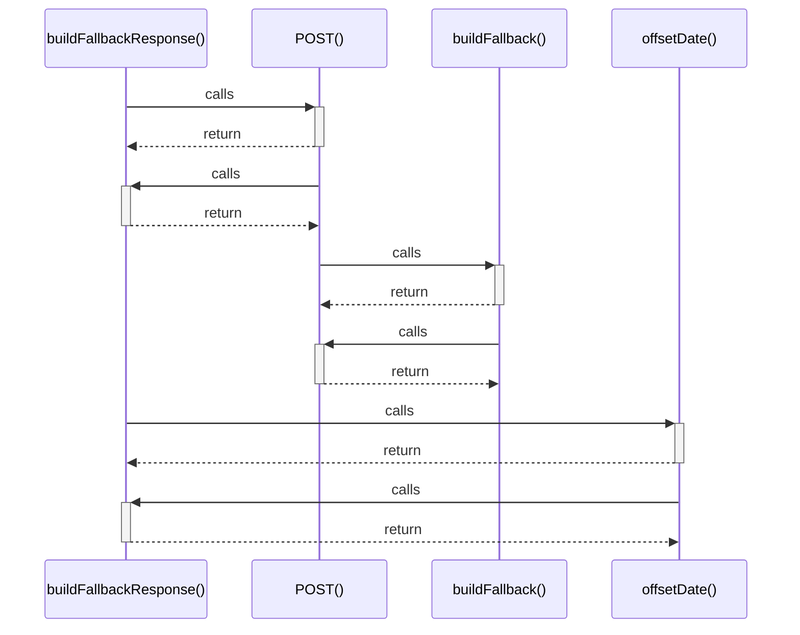

# buildFallbackResponse()

> God node · 3 connections · [C:\Users\Asus\.gemini\antigravity\scratch\studysync-ai\src\app\api\chat\route.ts](file:///C:/Users/Asus/.gemini/antigravity/scratch/studysync-ai/src/app/api/chat/route.ts#L121)

## Call Trace Diagram

## Connections by Relation

### calls
- [[POST()]] `EXTRACTED`
- [[offsetDate()]] `EXTRACTED`

### contains
- [[route.ts]] `EXTRACTED`

---

*Part of the graphify knowledge wiki. See [[index]] to navigate.*