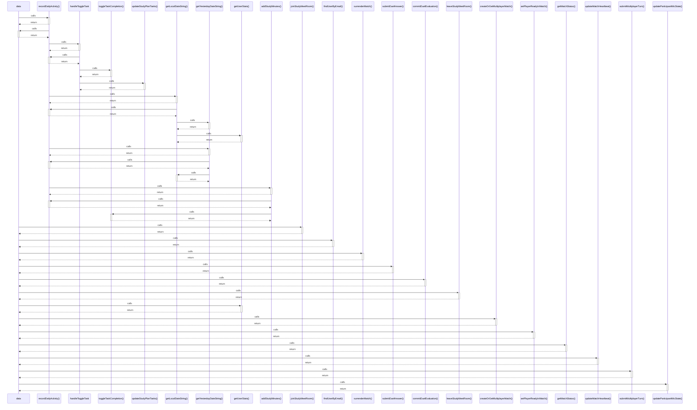

# data

> God node · 15 connections · [C:\Users\Asus\.gemini\antigravity\scratch\studysync-ai\src\components\study\MaterialUploader.tsx](file:///C:/Users/Asus/.gemini/antigravity/scratch/studysync-ai/src/components/study/MaterialUploader.tsx#L297)

## Call Trace Diagram

## Connections by Relation

### calls
- [[recordDailyActivity()]] `INFERRED`
- [[joinStudyMeetRoom()]] `INFERRED`
- [[findUserByEmail()]] `INFERRED`
- [[surrenderMatch()]] `INFERRED`
- [[submitDuelAnswer()]] `INFERRED`
- [[commitDuelEvaluation()]] `INFERRED`
- [[leaveStudyMeetRoom()]] `INFERRED`
- [[getUserStats()]] `INFERRED`
- [[createOrGetMultiplayerMatch()]] `INFERRED`
- [[setPlayerReadyInMatch()]] `INFERRED`
- [[getMatchStatus()]] `INFERRED`
- [[updateMatchHeartbeat()]] `INFERRED`
- [[submitMultiplayerTurn()]] `INFERRED`
- [[updateParticipantMicState()]] `INFERRED`

### contains
- [[MaterialUploader.tsx]] `EXTRACTED`

---

*Part of the graphify knowledge wiki. See [[index]] to navigate.*