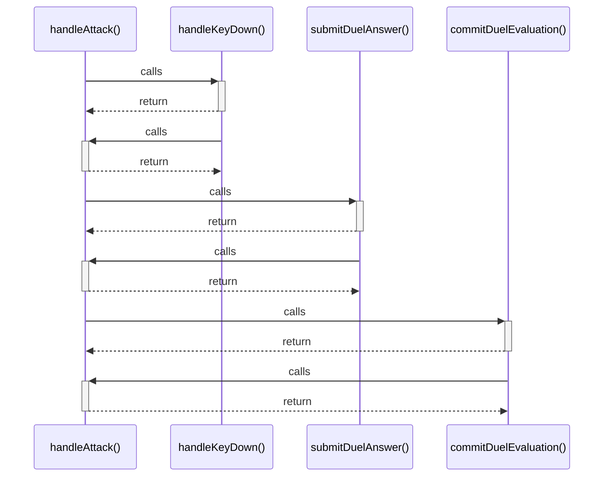

# handleAttack()

> God node · 4 connections · [C:\Users\Asus\.gemini\antigravity\scratch\studysync-ai\src\components\BossFightArena.tsx](file:///C:/Users/Asus/.gemini/antigravity/scratch/studysync-ai/src/components/BossFightArena.tsx#L689)

## Call Trace Diagram

## Connections by Relation

### calls
- [[handleKeyDown()]] `EXTRACTED`
- [[submitDuelAnswer()]] `INFERRED`
- [[commitDuelEvaluation()]] `INFERRED`

### contains
- [[BossFightArena.tsx]] `EXTRACTED`

---

*Part of the graphify knowledge wiki. See [[index]] to navigate.*