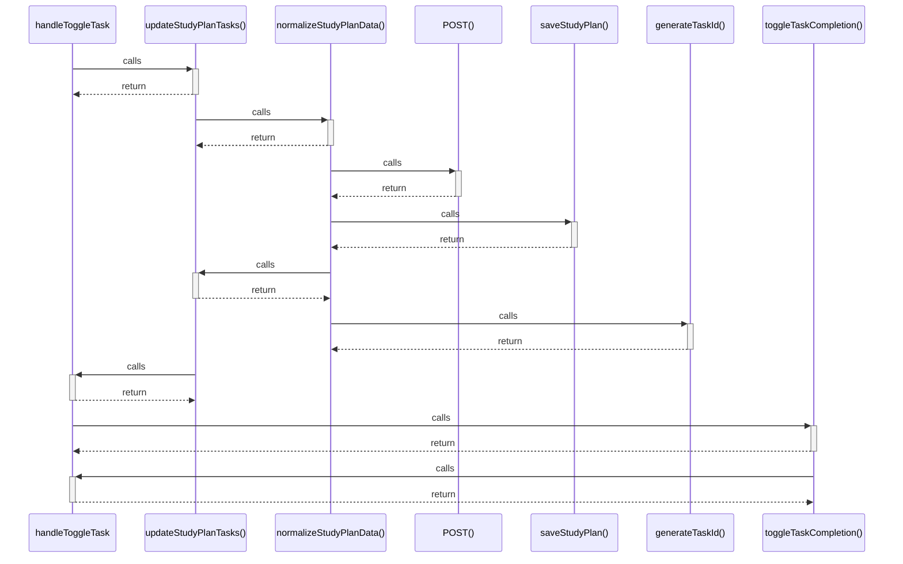

# handleToggleTask

> God node · 4 connections · [C:\Users\Asus\.gemini\antigravity\scratch\studysync-ai\src\app\dashboard\plan\page.tsx](file:///C:/Users/Asus/.gemini/antigravity/scratch/studysync-ai/src/app/dashboard/plan/page.tsx#L762)

## Call Trace Diagram

## Connections by Relation

### calls
- [[updateStudyPlanTasks()]] `INFERRED`
- [[toggleTaskCompletion()]] `INFERRED`

### contains
- [[page.tsx]] `EXTRACTED`
- [[page.tsx]] `EXTRACTED`

---

*Part of the graphify knowledge wiki. See [[index]] to navigate.*