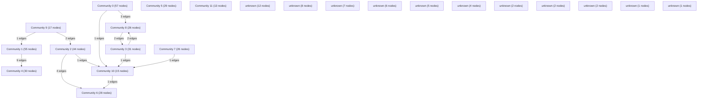

# Knowledge Graph Index

> Auto-generated by graphify. Start here — read community articles for context, then drill into god nodes for detail.

**421 nodes · 457 edges · 23 communities**

---

## System Architecture Flowchart

## Communities
(sorted by size, largest first)

- [[Community 0]] — 57 nodes
- [[Community 1]] — 55 nodes
- [[Community 2]] — 44 nodes
- [[Community 3]] — 31 nodes
- [[Community 4]] — 30 nodes
- [[Community 5]] — 29 nodes
- [[Community 6]] — 28 nodes
- [[Community 7]] — 26 nodes
- [[Community 8]] — 26 nodes
- [[Community 9]] — 17 nodes
- [[Community 10]] — 15 nodes
- [[Community 11]] — 13 nodes
- [[unknown]] — 12 nodes
- [[unknown]] — 8 nodes
- [[unknown]] — 7 nodes
- [[unknown]] — 6 nodes
- [[unknown]] — 5 nodes
- [[unknown]] — 4 nodes
- [[unknown]] — 2 nodes
- [[unknown]] — 2 nodes
- [[unknown]] — 2 nodes
- [[unknown]] — 1 nodes
- [[unknown]] — 1 nodes

## God Nodes
(most connected concepts — the load-bearing abstractions)

- [[POST()]] — 13 connections
- [[parseFileBuffer()]] — 5 connections
- [[router]] — 4 connections
- [[RESPONSE_SCHEMA]] — 4 connections
- [[EASE]] — 4 connections
- [[handleAttack()]] — 4 connections
- [[useAuth()]] — 4 connections
- [[saveStudyPlan()]] — 4 connections
- [[getStudyPlans()]] — 4 connections
- [[sendFriendRequest()]] — 4 connections

---

*Generated by [graphify](https://github.com/safishamsi/graphify)*