# Knowledge Graph Index

> Auto-generated by graphify. Start here — read community articles for context, then drill into god nodes for detail.

**449 nodes · 488 edges · 31 communities**

---

## System Architecture Flowchart

```mermaid
flowchart TD
    C0["Community 0 (79 nodes)"]
    C1["Community 1 (60 nodes)"]
    C2["Community 2 (55 nodes)"]
    C3["Community 3 (34 nodes)"]
    C4["Community 4 (29 nodes)"]
    C5["Community 5 (27 nodes)"]
    C6["Community 6 (26 nodes)"]
    C7["Community 7 (24 nodes)"]
    C8["Community 8 (21 nodes)"]
    C9["Community 9 (12 nodes)"]
    C10["Community 10 (9 nodes)"]
    C11["Community 11 (9 nodes)"]
    C12["unknown (8 nodes)"]
    C13["unknown (7 nodes)"]
    C14["unknown (6 nodes)"]
    C15["unknown (6 nodes)"]
    C16["unknown (6 nodes)"]
    C17["unknown (5 nodes)"]
    C18["unknown (4 nodes)"]
    C19["unknown (3 nodes)"]
    C20["unknown (3 nodes)"]
    C21["unknown (2 nodes)"]
    C22["unknown (2 nodes)"]
    C23["unknown (2 nodes)"]
    C24["unknown (2 nodes)"]
    C25["unknown (2 nodes)"]
    C26["unknown (2 nodes)"]
    C27["unknown (1 nodes)"]
    C28["unknown (1 nodes)"]
    C29["unknown (1 nodes)"]
    C30["unknown (1 nodes)"]
    C3 -->|7 edges| C2
    C1 -->|3 edges| C6
    C3 -->|1 edges| C0
    C4 -->|1 edges| C7
    C3 -->|1 edges| C7
    C7 -->|1 edges| C2
    C1 -->|1 edges| C7
    C8 -->|1 edges| C7
    C5 -->|1 edges| C7
    C6 -->|1 edges| C8
```

## Communities
(sorted by size, largest first)

- [[Community 0]] — 79 nodes
- [[Community 1]] — 60 nodes
- [[Community 2]] — 55 nodes
- [[Community 3]] — 34 nodes
- [[Community 4]] — 29 nodes
- [[Community 5]] — 27 nodes
- [[Community 6]] — 26 nodes
- [[Community 7]] — 24 nodes
- [[Community 8]] — 21 nodes
- [[Community 9]] — 12 nodes
- [[Community 10]] — 9 nodes
- [[Community 11]] — 9 nodes
- [[unknown]] — 8 nodes
- [[unknown]] — 7 nodes
- [[unknown]] — 6 nodes
- [[unknown]] — 6 nodes
- [[unknown]] — 6 nodes
- [[unknown]] — 5 nodes
- [[unknown]] — 4 nodes
- [[unknown]] — 3 nodes
- [[unknown]] — 3 nodes
- [[unknown]] — 2 nodes
- [[unknown]] — 2 nodes
- [[unknown]] — 2 nodes
- [[unknown]] — 2 nodes
- [[unknown]] — 2 nodes
- [[unknown]] — 2 nodes
- [[unknown]] — 1 nodes
- [[unknown]] — 1 nodes
- [[unknown]] — 1 nodes
- [[unknown]] — 1 nodes

## God Nodes
(most connected concepts — the load-bearing abstractions)

- [[POST()]] — 14 connections
- [[handleToggleTask]] — 5 connections
- [[normalizeStudyPlanData()]] — 5 connections
- [[recordDailyActivity()]] — 5 connections
- [[parseFileBuffer()]] — 5 connections
- [[router]] — 4 connections
- [[RESPONSE_SCHEMA]] — 4 connections
- [[EMIL_EASE_ARR]] — 4 connections
- [[containerVariants]] — 4 connections
- [[handleAttack]] — 4 connections

---

*Generated by [graphify](https://github.com/safishamsi/graphify)*