# Knowledge Graph Index

> Auto-generated by graphify. Start here — read community articles for context, then drill into god nodes for detail.

**240 nodes · 254 edges · 20 communities**

---

## System Architecture Flowchart

```mermaid
flowchart TD
    C0["Community 0 (39 nodes)"]
    C1["Community 1 (37 nodes)"]
    C2["Community 2 (27 nodes)"]
    C3["Community 3 (24 nodes)"]
    C4["Community 4 (23 nodes)"]
    C5["Community 5 (13 nodes)"]
    C6["Community 6 (12 nodes)"]
    C7["Community 7 (11 nodes)"]
    C8["Community 8 (10 nodes)"]
    C9["Community 9 (8 nodes)"]
    C10["Community 10 (7 nodes)"]
    C11["Community 11 (6 nodes)"]
    C12["unknown (6 nodes)"]
    C13["unknown (5 nodes)"]
    C14["unknown (4 nodes)"]
    C15["unknown (2 nodes)"]
    C16["unknown (2 nodes)"]
    C17["unknown (2 nodes)"]
    C18["unknown (1 nodes)"]
    C19["unknown (1 nodes)"]
    C2 -->|4 edges| C3
    C0 -->|3 edges| C4
    C1 -->|2 edges| C3
    C5 -->|1 edges| C4
    C0 -->|1 edges| C12
    C1 -->|1 edges| C12
    C2 -->|1 edges| C12
```

## Communities
(sorted by size, largest first)

- [[Community 0]] — 39 nodes
- [[Community 1]] — 37 nodes
- [[Community 2]] — 27 nodes
- [[Community 3]] — 24 nodes
- [[Community 4]] — 23 nodes
- [[Community 5]] — 13 nodes
- [[Community 6]] — 12 nodes
- [[Community 7]] — 11 nodes
- [[Community 8]] — 10 nodes
- [[Community 9]] — 8 nodes
- [[Community 10]] — 7 nodes
- [[Community 11]] — 6 nodes
- [[unknown]] — 6 nodes
- [[unknown]] — 5 nodes
- [[unknown]] — 4 nodes
- [[unknown]] — 2 nodes
- [[unknown]] — 2 nodes
- [[unknown]] — 2 nodes
- [[unknown]] — 1 nodes
- [[unknown]] — 1 nodes

## God Nodes
(most connected concepts — the load-bearing abstractions)

- [[POST()]] — 5 connections
- [[EASE]] — 4 connections
- [[{ user }]] — 4 connections
- [[sendMessage()]] — 4 connections
- [[handleAttack()]] — 4 connections
- [[getStudyPlans()]] — 4 connections
- [[sendFriendRequest()]] — 4 connections
- [[RESPONSE_SCHEMA]] — 3 connections
- [[SYSTEM_INSTRUCTION]] — 3 connections
- [[buildFallbackResponse()]] — 3 connections

---

*Generated by [graphify](https://github.com/safishamsi/graphify)*