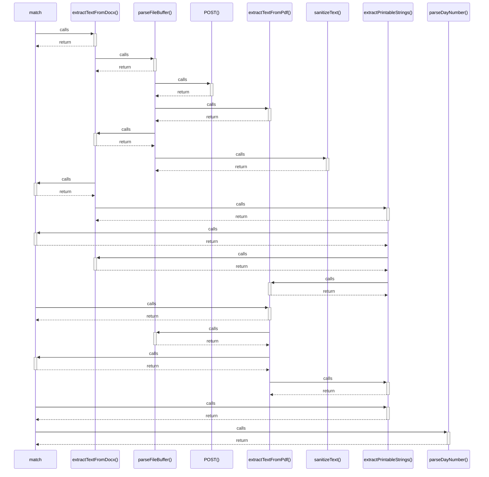

# match

> God node · 5 connections · [C:\Users\Asus\.gemini\antigravity\scratch\studysync-ai\src\components\study\MaterialUploader.tsx](file:///C:/Users/Asus/.gemini/antigravity/scratch/studysync-ai/src/components/study/MaterialUploader.tsx#L129)

## Call Trace Diagram

## Connections by Relation

### calls
- [[extractTextFromDocx()]] `INFERRED`
- [[extractTextFromPdf()]] `INFERRED`
- [[extractPrintableStrings()]] `INFERRED`
- [[parseDayNumber()]] `INFERRED`

### contains
- [[MaterialUploader.tsx]] `EXTRACTED`

---

*Part of the graphify knowledge wiki. See [[index]] to navigate.*