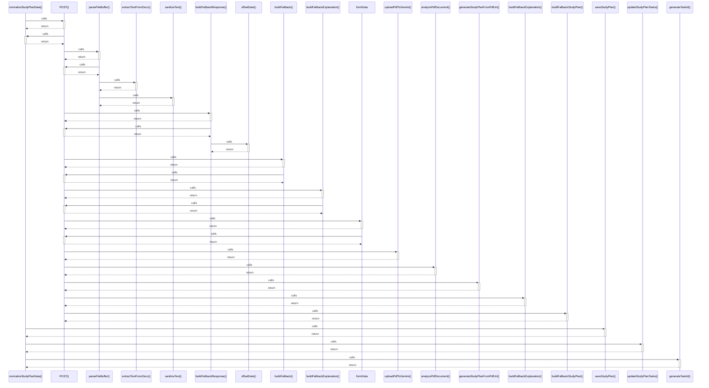

# normalizeStudyPlanData()

> God node · 5 connections · [C:\Users\Asus\.gemini\antigravity\scratch\studysync-ai\src\lib\normalizeStudyPlan.ts](file:///C:/Users/Asus/.gemini/antigravity/scratch/studysync-ai/src/lib/normalizeStudyPlan.ts#L61)

## Call Trace Diagram

## Connections by Relation

### calls
- [[POST()]] `INFERRED`
- [[saveStudyPlan()]] `INFERRED`
- [[updateStudyPlanTasks()]] `INFERRED`
- [[generateTaskId()]] `EXTRACTED`

### contains
- [[normalizeStudyPlan.ts]] `EXTRACTED`

---

*Part of the graphify knowledge wiki. See [[index]] to navigate.*