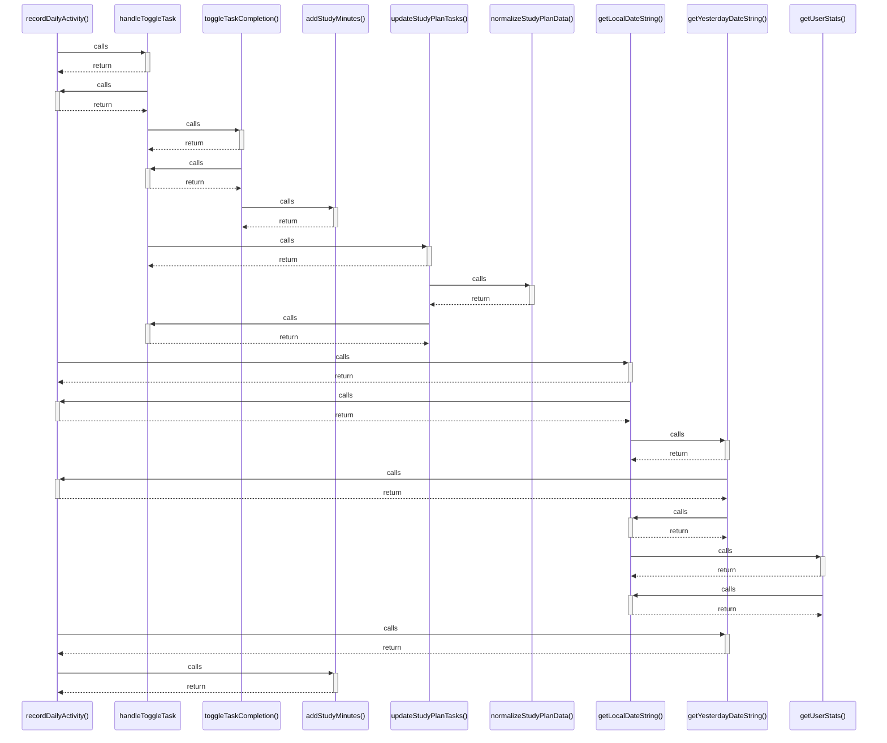

# recordDailyActivity()

> God node · 5 connections · [C:\Users\Asus\.gemini\antigravity\scratch\studysync-ai\src\lib\firebase\userStats.ts](file:///C:/Users/Asus/.gemini/antigravity/scratch/studysync-ai/src/lib/firebase/userStats.ts#L69)

## Call Trace Diagram

## Connections by Relation

### calls
- [[handleToggleTask]] `INFERRED`
- [[getLocalDateString()]] `EXTRACTED`
- [[getYesterdayDateString()]] `EXTRACTED`
- [[addStudyMinutes()]] `EXTRACTED`

### contains
- [[userStats.ts]] `EXTRACTED`

---

*Part of the graphify knowledge wiki. See [[index]] to navigate.*