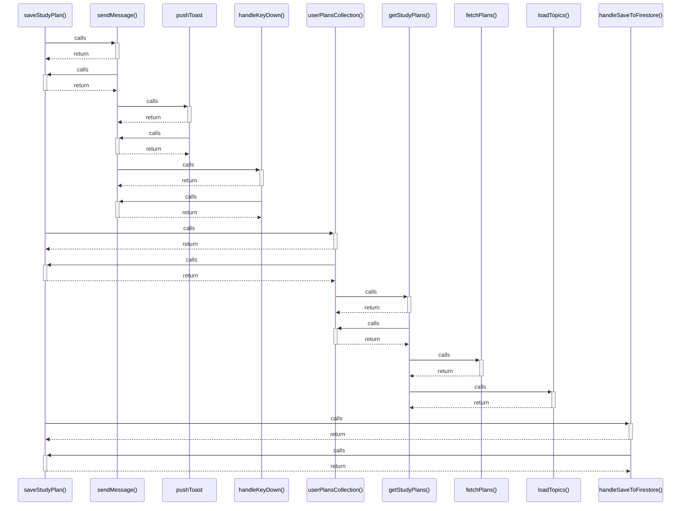

# saveStudyPlan()

> God node · 4 connections · [C:\Users\Asus\.gemini\antigravity\scratch\studysync-ai\src\lib\firebase\db.ts](file:///C:/Users/Asus/.gemini/antigravity/scratch/studysync-ai/src/lib/firebase/db.ts#L78)

## Call Trace Diagram

## Connections by Relation

### calls
- [[sendMessage()]] `INFERRED`
- [[userPlansCollection()]] `EXTRACTED`
- [[handleSaveToFirestore()]] `INFERRED`

### contains
- [[db.ts]] `EXTRACTED`

---

*Part of the graphify knowledge wiki. See [[index]] to navigate.*