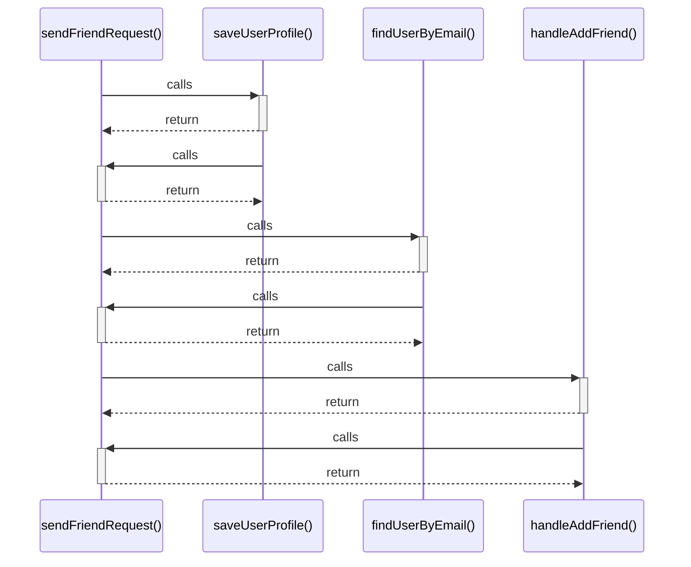

# sendFriendRequest()

> God node · 4 connections · [C:\Users\Asus\.gemini\antigravity\scratch\studysync-ai\src\lib\firebase\friends.ts](file:///C:/Users/Asus/.gemini/antigravity/scratch/studysync-ai/src/lib/firebase/friends.ts#L132)

## Call Trace Diagram

## Connections by Relation

### calls
- [[saveUserProfile()]] `EXTRACTED`
- [[findUserByEmail()]] `EXTRACTED`
- [[handleAddFriend()]] `INFERRED`

### contains
- [[friends.ts]] `EXTRACTED`

---

*Part of the graphify knowledge wiki. See [[index]] to navigate.*