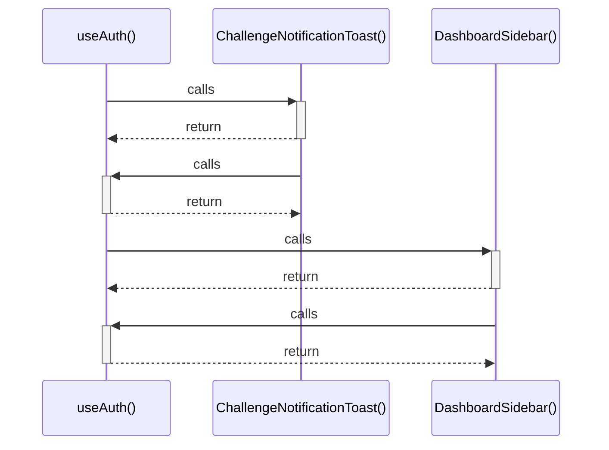

# useAuth()

> God node · 3 connections · [C:\Users\Asus\.gemini\antigravity\scratch\studysync-ai\src\lib\contexts\AuthContext.tsx](file:///C:/Users/Asus/.gemini/antigravity/scratch/studysync-ai/src/lib/contexts/AuthContext.tsx#L106)

## Call Trace Diagram

## Connections by Relation

### calls
- [[ChallengeNotificationToast()]] `INFERRED`
- [[DashboardSidebar()]] `INFERRED`

### contains
- [[AuthContext.tsx]] `EXTRACTED`

---

*Part of the graphify knowledge wiki. See [[index]] to navigate.*